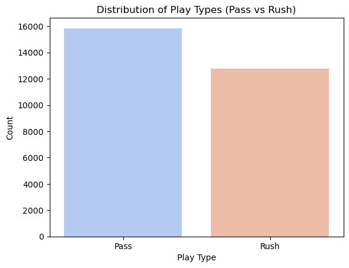

# NFLPlayPrediction

## Project Overview

In American football, every play begins with the offense attempting to advance the ball down the field to score points. There are two main types of plays:
- **Pass Play:** The quarterback throws the ball to a receiver.
- **Run Play:** The ball is handed off to a running back, who attempts to advance it by running.

Understanding whether a play is a pass or a run is crucial for game strategy, as defensive teams often adjust their formations and tactics based on what they anticipate the offense will do. From a sports analytics perspective, accurately predicting play types can provide valuable insights into game dynamics and help coaches and analysts make data-driven decisions.

The goal of this project is to develop machine learning models to predict whether a play will be a pass or a run based on various game-related features, such as the quarter, down, yards to go, and team-specific win probabilities. By analyzing data from the NFL Big Data Bowl datasets of 2024 and 2025, this project seeks to demonstrate how statistical and machine learning methods can be applied to real-world sports problems.

### Motivation
Predicting play types has several potential applications:
1. **Team Strategy:** Assisting coaches and analysts in understanding opponent tendencies and making real-time decisions during games.
2. **Sports Broadcasting:** Enhancing viewer experience by providing predictions and insights during live games.
3. **Fantasy Sports:** Improving player and team evaluations for fantasy sports enthusiasts.
4. **Education:** Offering an example of how machine learning can be applied to sports analytics.

This project explores the data-driven nature of football and demonstrates how machine learning models can learn patterns and make predictions using structured datasets. The results highlight the effectiveness of ensemble methods, such as Random Forest and XGBoost, while identifying potential areas for improvement in simpler models like Logistic Regression and Neural Networks.

## Problem Summary

The goal of this project is to predict whether an NFL play will be a **pass** or a **run** using data from the NFL Big Data Bowl datasets of 2024 and 2025. The datasets include various features describing the game situation, teams, and play conditions. However, the target variable (whether the play is a pass or a run) is not directly provided. We infer the target using the `passResult` variable:
- **Pass Play:** If `passResult` contains a valid value.
- **Run Play:** If `passResult` is NaN.

### Dataset Summary:
- **Source:** NFL Big Data Bowl 2024 and 2025 datasets.
- **Target Variable:** Created from `passResult` (0 for pass, 1 for run).
- **Balanced Data:** The dataset is balanced between pass and run plays, as shown in the graph below:



---

## Data Processing

To prepare the data for modeling, we performed the following steps:

1. **Data Loading:**
   - Combined data from two seasons (`plays2024.csv` and `plays2025.csv`) using common features such as `quarter`, `down`, `yardsToGo`, `gameClock`, etc.
   - Removed unnecessary columns and retained only relevant features.

2. **Feature Engineering:**
   - **Time Left in Half:** Calculated the time remaining in the half by considering the quarter and the game clock.
   - **Point Differential:** Derived from the pre-snap scores of the possession and defensive teams.
   - **Win Probability Difference:** Calculated as the difference between the home and visitor teams' pre-snap win probabilities.

3. **Encoding Categorical Features:**
   - Encoded categorical columns (`possessionTeam`, `defensiveTeam`, `offenseFormation`) using `LabelEncoder`.

4. **Target Variable Creation:**
   - Created a binary target variable:
     - **0** for pass plays.
     - **1** for run plays.

5. **Final Dataset:**
   - Removed unnecessary columns (`gameClock`, `gameId`, and pre-snap scores and probabilities).
   - The final dataset includes engineered features such as `timeLeftHalf`, `pointDifferential`, and `winProbabilityDiff`, along with other relevant variables.

### Preprocessing Summary:

| **Step**                 | **Description**                                                                 |
|--------------------------|---------------------------------------------------------------------------------|
| Data Merging             | Combined data from 2024 and 2025 datasets.                                      |
| Time Calculation         | Converted game clock and quarter into seconds remaining in the half.           |
| Point Differential       | Derived score differences between possession and defensive teams.              |
| Categorical Encoding     | Encoded team names and formations into numerical labels.                       |
| Target Label Creation    | Converted `passResult` into a binary target variable for pass/run prediction.  |

---

## Models and Results

The table below summarizes the performance of different models used in this project. Each model's accuracy and mean cross-validation (CV) score are provided for comparison.

| **Model**             | **Accuracy**         | **Mean CV Score**       |
|-----------------------|---------------------|------------------------|
| Logistic Regression   | 0.6575              | 0.6638                 |
| Random Forest         | 0.9075              | 0.8927                 |
| Decision Tree         | 0.8864              | 0.8691                 |
| XGBoost               | 0.9011              | 0.8889                 |
| Neural Network        | 0.7088              | 0.6897                 |

### Observations:
- **Random Forest** achieved the highest accuracy (90.75%) and the best mean CV score (89.27%), making it the most effective model in this experiment.
- **XGBoost** closely followed, with an accuracy of 90.11% and a mean CV score of 88.89%.
- **Logistic Regression** and **Neural Network** models showed relatively poor accuracy.
- **Decision Tree** performed well but slightly lagged behind Random Forest and XGBoost, highlighting the importance of ensemble methods.

---

## Evaluation Metrics

To evaluate the performance of our models, we used **accuracy** as the primary metric since the dataset is balanced between pass plays and run plays. Accuracy provides a straightforward way to measure how often the model's predictions match the actual play type.

### Accuracy:
Accuracy is calculated as:

**Accuracy = (Number of Correct Predictions) / (Total Number of Predictions)**

Given that the dataset is balanced, accuracy effectively represents the overall performance of the model without the need for additional metrics like precision or recall.

### Confusion Matrix:
The confusion matrix from our best-performing model (Random Forest) is shown below:


#### Key Insights:
- **Class 0 (Pass):**
  - True Positives: 2859 (Correctly predicted as Pass)
  - False Negatives: 184 (Incorrectly predicted as Run)
- **Class 1 (Run):**
  - True Positives: 2334 (Correctly predicted as Run)
  - False Positives: 345 (Incorrectly predicted as Pass)

This confusion matrix confirms the strong performance of the Random Forest model, with a minimal number of misclassifications. It demonstrates the model's ability to effectively distinguish between pass and run plays.

---

## Usage Instructions

### Step 1: Clone the repository
```bash
git clone https://github.com/ArjunR27/NFLPlayPrediction.git
cd NFLPlayPrediction
```

### Step 2: Set up the environment
Activate the environment using the `environment.yml` file:
```bash
conda env create -f environment.yml
conda activate csc466
```

### Step 3: Explore `notebooks` directory
Play around with the code we used for data exploration, data preprocessing, and model building

---

## References

1. **NFL Big Data Bowl 2025**  
   Michael Lopez, Thompson Bliss, Ally Blake, Paul Mooney, and Addison Howard. *NFL Big Data Bowl 2025*. [Kaggle](https://kaggle.com/competitions/nfl-big-data-bowl-2025), 2024.

2. **NFL Big Data Bowl 2024**  
   Michael Lopez, Thompson Bliss, Ally Blake, Andrew Patton, Jonathan McWilliams, Addison Howard, and Will Cukierski. *NFL Big Data Bowl 2024*. [Kaggle](https://kaggle.com/competitions/nfl-big-data-bowl-2024), 2023.

3. **scikit-learn**  
   Machine Learning in Python. [scikit-learn Documentation](https://scikit-learn.org/stable/).

4. **pandas**  
   Python Data Analysis Library. [pandas Documentation](https://pandas.pydata.org/).
